---
format:
  closeread-html:
    cr-style:
      narrative-background-color-overlay: black
      narrative-text-color-overlay: "#e2e2e2"
      section-background-color: black
      narrative-text-color-sidebar: "#e2e2e2"
output-file: index
---
:::{.cr-section layout="overlay-center"}

:::{focus-on="cr-titleimg"}
# Pipelines
Cloud-based, automated stock assessments.
:::

:::{#cr-titleimg}

:::

:::

<!--- end title block --->

::: {.cr-section layout="overlay-center"}

::: {focus-on}
## Why we pursued automation?
Current administration and leadership priorities closely align with the workflows project, FIMS, cloud migration, and data modernization creating opportunities for linkages and foundational components for automation.
:::

:::

<!--- end why q block --->

::: {.cr-section layout="overlay-center"}

*Efficiency:*<br><br>Improved and streamlined processes leads to increased throughput and better reproducibility.[@cr-efficiency]

:::{#cr-efficiency}

:::

**Cloud Migration**<br><br>Transition of data to the cloud opens a new realm of possibilities and automation due to lower barriers to access.[@cr-cloud-migration]

:::{#cr-cloud-migration}

:::

**Centralized Efforts**<br><br>A variety of collaborative projects involving scientists from all regions building tools that will be broadly used.[@cr-efforts]

:::{#cr-efforts}

:::

**Standardization**<br><br>Same process, same standards, same approach means more efficient process and more support across the agency.[@cr-std]

:::{#cr-std}
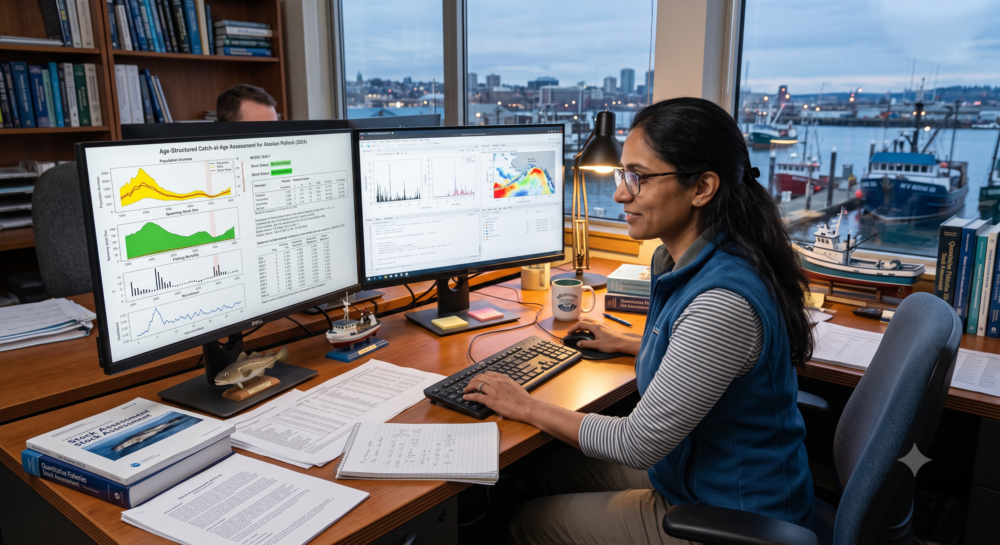
:::

:::

<!--- end reasons block --->

:::{.cr-section layout="overlay-center"}

## Foundational Projects:

:::


::: {.cr-section layout="sidebar-right"}

::: {.progress-block}

@cr-sequence-clouds

**1. Cloud Migration**
<br><br>*Develop and implement an enterprise modernization plan for fishery-dependent data systems.*<br><br>Both data and virtual machines provides links to more accessible data via APIs.<br>
<br>**Goals:**
<br>
* Develop and Deploy Fully Enabled Cloud Solutions
<br>
* Promote a Data-Driven Culture Through the Adoption of Open Science Initiatives
<br>
* Formalize the Operating Model for Modernization
<br>
* Align Data Management and System Standards

:::

:::{#cr-sequence-clouds}
```{ojs}
//| echo: false
images = [
  "assets/clouds/frame_00_delay-0.1s.jpg",
  "assets/clouds/frame_01_delay-0.1s.jpg",
  "assets/clouds/frame_02_delay-0.1s.jpg",
  "assets/clouds/frame_03_delay-0.1s.jpg",
  "assets/clouds/frame_04_delay-0.1s.jpg", 
  "assets/clouds/frame_05_delay-0.1s.jpg",
  "assets/clouds/frame_06_delay-0.1s.jpg",
  "assets/clouds/frame_07_delay-0.1s.jpg",
  "assets/clouds/frame_08_delay-0.1s.jpg",
  "assets/clouds/frame_09_delay-0.1s.jpg",
  "assets/clouds/frame_10_delay-0.1s.jpg",
  "assets/clouds/frame_11_delay-0.1s.jpg",
  "assets/clouds/frame_12_delay-0.1s.jpg",
  "assets/clouds/frame_13_delay-0.1s.jpg",
  "assets/clouds/frame_14_delay-0.1s.jpg",
  "assets/clouds/frame_15_delay-0.1s.jpg"
]

// If this section's first trigger is the 3rd trigger in the document, subtract 2
// We use Math.max to make sure we don't end up with a negative index
relativeIndex = crTriggerIndex !== null ? Math.max(0, crTriggerIndex - 5) : 0

// Cap it so it doesn't try to load an image beyond index 15
currentIndex = Math.min(relativeIndex, images.length - 1)

html``

angleScale1 = d3.scaleLinear()
  .domain([0, 1])
  .range([-180, 0])
  .clamp(true)
    
angle1 = angleScale1(crProgressBlock)
```
:::

:::

::: {.cr-section layout="sidebar-left"}

**2. Data Modernization**<br><br>Transforming field observations into standardized, "downstream-ready" assets.[@cr-mod-1]

Aim to increase uniformity of data across science centers which will enable a more efficient and streamlined stock assessments.[@cr-mod-2]

<br>
Data should be usable without bespoke cleaning and can be immediately used for assessment products such as calculating indices of abundance or growth modelling to lead into assessment input files.<br><br>{surveyjoin}<br><br>{FISHGLOB}[@cr-mod-3]

<br>
Automated and human-led quality control measure[@cr-mod-4]

:::{#cr-mod-1}
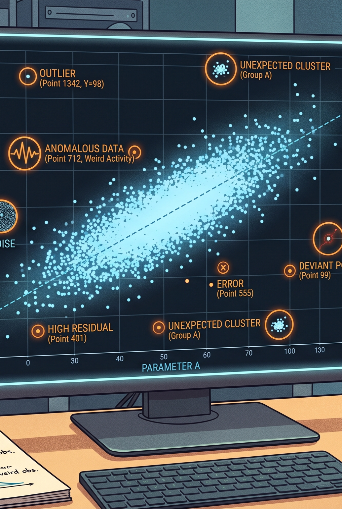
:::

:::{#cr-mod-2}
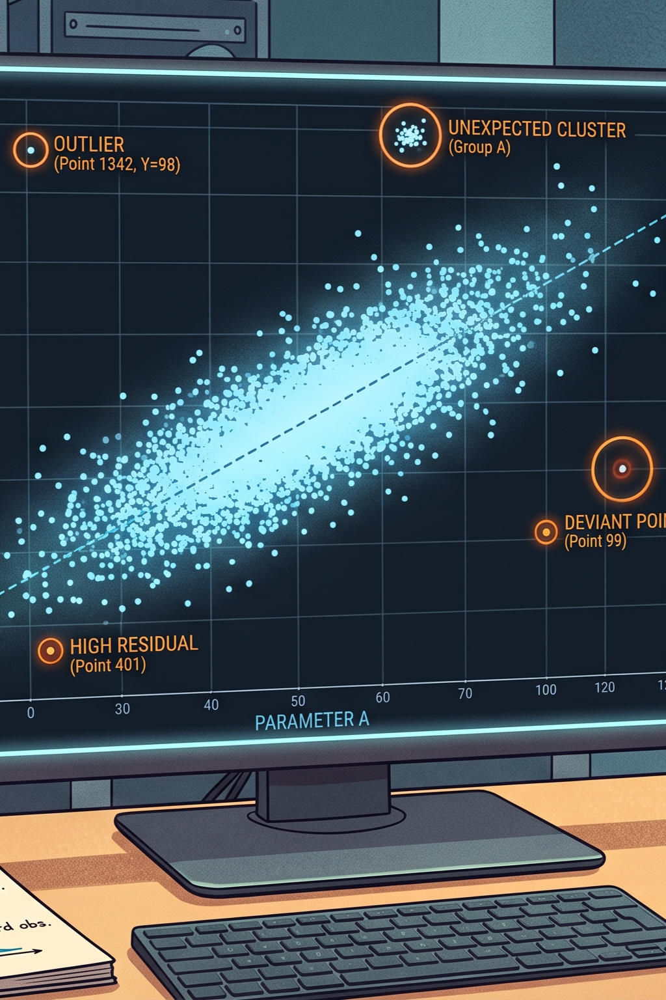
:::

:::{#cr-mod-3}
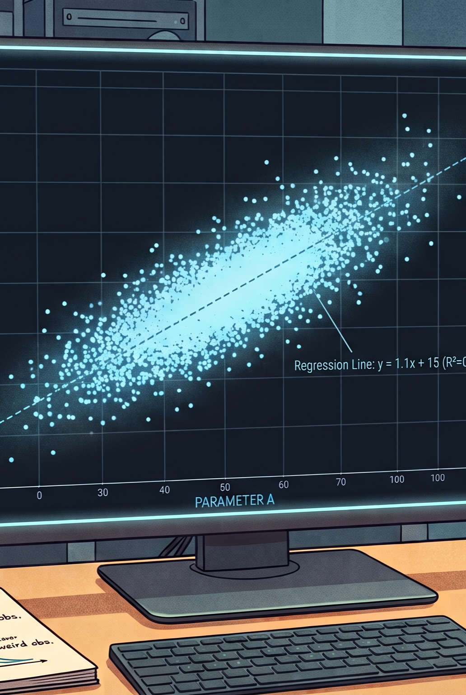
:::

:::{#cr-mod-4}
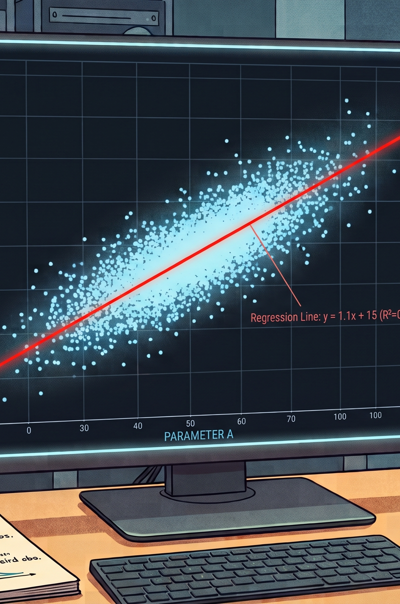
:::

:::

:::{.cr-section layout="sidebar-right"}

::: {.progress-block}

[@cr-sequence-fims]

**3. Fisheries Integrated Modelling Systems**<br><br>FIMS aims to accomplish its mission with a user-friendly stock assessment tool that streamlines the development and application of scientific advice to inform current and future management needs of NOAA Fisheries’ regions. This can be acheived through:
<br>
1. **Meeting the needs** of operational stock assessments across regions, scenarios, and data types. 
<br>
2. Implementing practical and **robust methods.**
<br>
3. **Estimating and projecting** population trajectories, parameters, and uncertainty.
<br>
4. Spanning **different levels of expertise.**
<br>
5. Incorporating **user, developer, and community** contributions and feedback.
<br>
6. Develop a **flexible architecture** to adapt to future management needs and technical advancements.
<br>
<br>
Also operational through R code<br><br>```
library(FIMS) 
# Load sample data 
data("data_big") 
# Prepare data for FIMS model 
data_4_model <- FIMSFrame(data_big) 
# Create parameters 
parameters <- data_4_model |> 
  create_default_configurations() |> 
  create_default_parameters(data = data_4_model) 
# Run the model with optimization 
fit <- parameters |> 
  initialize_fims(data = data_4_model) |> 
  fit_fims(optimize = TRUE) 
# Clear memory post-run 
clear()```

:::

:::{#cr-sequence-fims}
```{ojs}
//| echo: false
images = [
  "assets/fims_animation/1.png",
  "assets/fims_animation/2.png",
  "assets/fims_animation/3.png",
  "assets/fims_animation/4.png",
  "assets/fims_animation/5.png",
  "assets/fims_animation/6.png",
  "assets/fims_animation/7.png",
  "assets/fims_animation/8.png",
  "assets/fims_animation/9.png",
  "assets/fims_animation/10.png",
  "assets/fims_animation/11.png",
  "assets/fims_animation/12.png",
  "assets/fims_animation/13.png",
  "assets/fims_animation/14.png",
  "assets/fims_animation/15.png",
  "assets/fims_animation/16.png",
  "assets/fims_animation/17.png",
  "assets/fims_animation/18.png",
  "assets/fims_animation/19.png"
]

// If this section's first trigger is the 3rd trigger in the document, subtract 2
// We use Math.max to make sure we don't end up with a negative index
relativeIndex = crTriggerIndex !== null ? Math.max(0, crTriggerIndex - 24) : 0

// Cap it so it doesn't try to load an image beyond index 15
currentIndex = Math.min(relativeIndex, images.length - 1)

html``

angleScale1 = d3.scaleLinear()
  .domain([0, 1])
  .range([-180, 0])
  .clamp(true)
    
angle1 = angleScale1(crProgressBlock)
```
:::

:::

::: {.cr-section layout="sidebar-left"}

::: {.progress-block}

[@cr-sequence-workflows]

**4. The Workflows Project**<br><br>A focus on standardization and semi-automation of stock assessment reports.
<br>
Built upon a need to identify bottlenecks:
<br>
* Data processing
<br>
* Reporting requirements
<br>
* Section 508 compliance
<br>
Currently, the team built 2 R packages that addresses partial automation of reports including full-automation to make reports 508 compliant.
<br>
<br>
**{asar}**
<br>
Build the foundation to standardization reporting along with a set of NOAA Fisheries Stock Assessment report guidelines through R code and a reproducible approach using Quarto.<br><br>```
library(asar)
# create report template
asar::create_template(
  species = "Petrale sole",
    authors = c("Jane Doe"="OST"),
    region = "West Coast",
    office = "NWFSC")
# render report
quarto::quarto_render("sar_WC_Petrale_sole_skeleton.qmd")
```
<br><br>
**{stockplotr}**<br>```
library(stockplotr)
# standardize model output
petrale <- convert_output(file = "Report.sso")
# Create a table
table_index(petrale)
# Create_figure
plot_spawning_biomass(petrale)
```
:::

:::{#cr-sequence-workflows}
```{ojs}
//| echo: false
images = [
  "assets/fims_animation/1.png",
  "assets/fims_animation/2.png",
  "assets/fims_animation/3.png",
  "assets/fims_animation/4.png",
  "assets/fims_animation/5.png",
  "assets/fims_animation/6.png",
  "assets/fims_animation/7.png",
  "assets/fims_animation/8.png",
  "assets/fims_animation/9.png",
  "assets/fims_animation/10.png",
  "assets/fims_animation/11.png",
  "assets/fims_animation/12.png",
  "assets/fims_animation/13.png",
  "assets/fims_animation/14.png",
  "assets/fims_animation/15.png",
  "assets/fims_animation/16.png",
  "assets/fims_animation/17.png",
  "assets/fims_animation/18.png",
  "assets/fims_animation/19.png"
]

// If this section's first trigger is the 3rd trigger in the document, subtract 2
// We use Math.max to make sure we don't end up with a negative index
relativeIndex = crTriggerIndex !== null ? Math.max(0, crTriggerIndex - 24) : 0

// Cap it so it doesn't try to load an image beyond index 15
currentIndex = Math.min(relativeIndex, images.length - 1)

html``
```
:::

:::

<!--- end projects block --->

:::{.cr-section layout="overlay-center"}

The Stock Assessment Pipeline [@cr-underwater]

:::{#cr-underwater}

:::

:::

<!--- end pipeline title transition block --->

:::{.cr-section layout="sidebar-right"}

Let's Dive In<br>[@cr-diver]
Each piece of the pipeline connects to form partially and fully automated components. Each of these "modules" could be incorporated into the workflow of an assessment scientist at NOAA.[@cr-diver]

Intention[@cr-diver]

1. Provide assessment scientists with the supplies to build the foundation for an automated workflow.[@cr-diver]

2. Build and understand the principles of a workflow in the cloud.[@cr-diver]

3. Provide modules that can be extracted from the pipeline.[@cr-diver]

4. Find solutions to make cloud data and data processing more attainable.[@cr-diver]

**Long term goal: an established pipeline that can provide annual updates for a given stock triggered by new data.**<br>NOTE: This is in early stage development and processes are not completely developed. We are currently working to make connections among projects and current efforts along with identifying points of contact for each portion of the pipeline. We plan to make use of existing and new efforts to develop a working example to demonstrate the potential for an established automated stock assessment workflow.[@cr-diver]

:::{#cr-diver}

:::

:::

<!--- end dive in block --->

:::{.cr-section layout="overlay-right"}

Storage in the cloud, QA/QC, 99% ready. [@cr-data]

:::{#cr-data} 

:::

Variety of approaches to cloud: Google Drive, Data Buckets, Oracle. [@cr-data-storage]

:::{#cr-data-storage} 
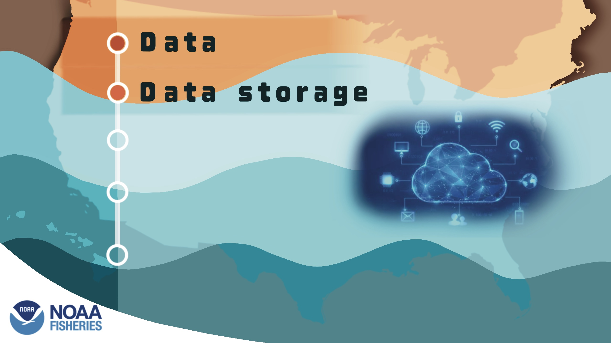
:::

Goal is to have all assessment models available on virtual machines. [@cr-modelling]

:::{#cr-modelling} 
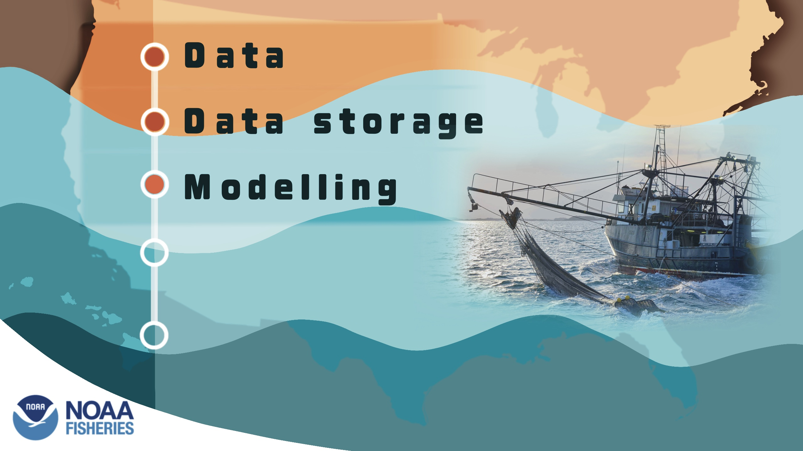
:::

Cloud storage of all model output to archive and pull for monitoring and reference in future cycles. [@cr-model-output]

:::{#cr-model-output} 
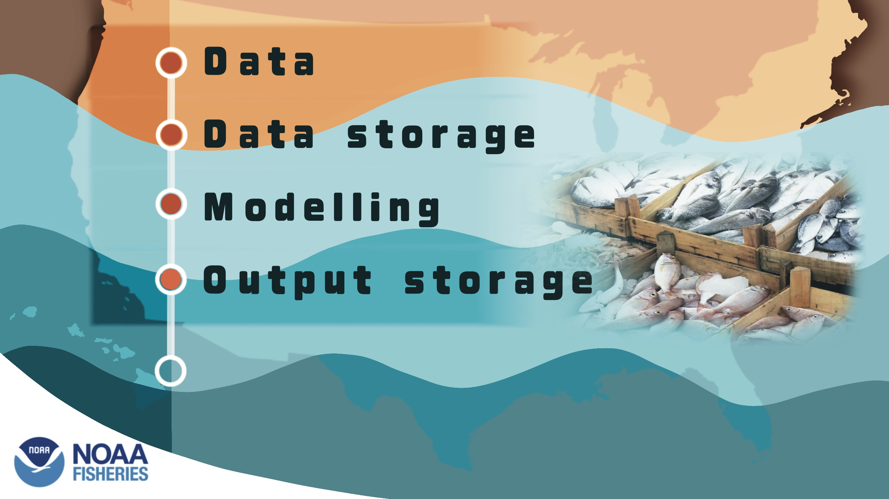
:::

Presenting data on platforms such as Stock Smart, GitHub, and reports. [@cr-output]

:::{#cr-output} 
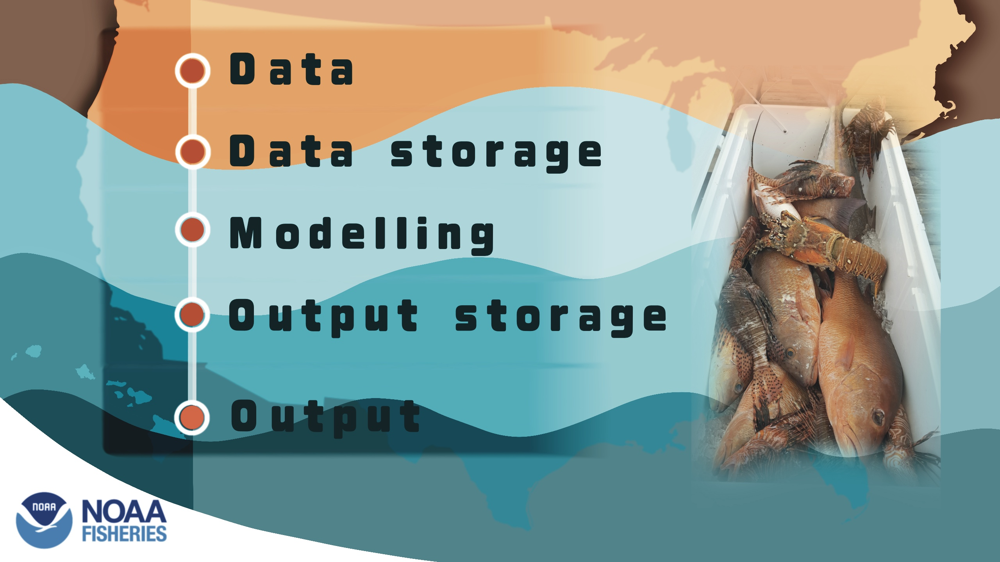
:::

:::

<!--- end summ pipeline block --->

:::{.cr-section .centered-story layout="overlay-right"}

Pipeline Modules [@cr-larg-pipe]

**Survey Tracking**<br><br>Linkages to surveys in assessments.<br><br>By establishing a process that pulls data from specific surveys, we will be able to directly identify then measure the surveys used in assessments and help calculate their impact. [@cr-larg-pipe]{scale-by="3" pan-to="98%,70%"}

**QA/QC & 99% Use-Case Data**<br><br>Data is available and ready for analysis.<br><br>The 99% use-case standard product is the operational, "downstream-ready" standard for all survey data, ensuring 99% of assessment users can utilize it without bespoke cleaning. This data is fully accessible in the cloud. [@cr-larg-pipe]{scale-by="3" pan-to="68%,70%"}

**Data Processing**<br><br>R packages to extract and clean.<br><br>Fundamental improvements to data quality and preparation have been in the works. The mandate to move data to the cloud by the end of 2026 makes data readily available to create linkages for data extraction and preparation packages. [@cr-larg-pipe]{scale-by="3" pan-to="39%,70%"}

**Data Preparation**<br><br>Getting data input ready.<br><br>Making use of the many currently available packages along with transforming current code into R package structures and functions will allow scientists to create reproducible workflows leading to automation.<br>By having a centralized location and approach, we can link indices of abundance to other down-stream products like DisMAP. [@cr-larg-pipe]{scale-by="3" pan-to="-5%,70%"}

**Virtual Machines**<br><br>Accessible online containing pre-configured assessment models.<br><br>Once established, the scientist can execute the assessment model, bridging code, and sensitivity runs on the machine.<br><br>
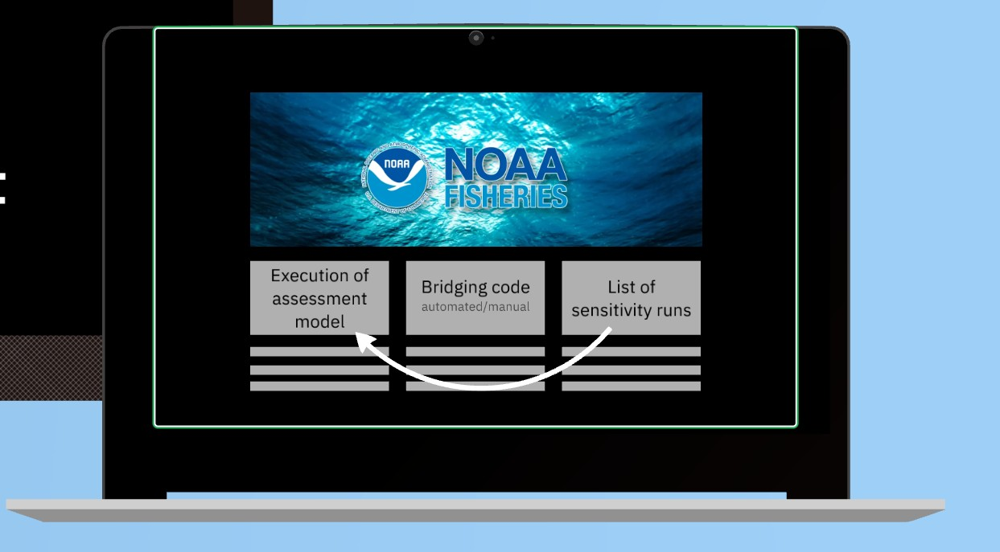
<br>Bash scripts and R scripts for other processes during execution of the model are stored in GitHub. [@cr-larg-pipe]{scale-by="3" pan-to="-33%,70%"}

**GitHub**<br><br>Stores scripts and other files to execute the pipeline.<br><br>Most of the processes that create the automated pipeline are stored in the GitHub repository specific to a stock.<br><br>
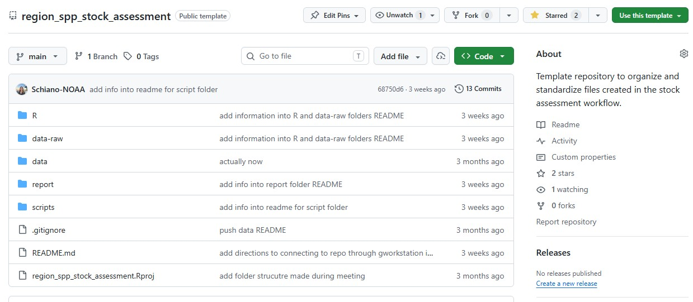
<br>We can use "tagging" in a repository to identify the year of the assessment without exponentially increasing the number of files in the repository. [@cr-larg-pipe]{scale-by="3" pan-to="-33%,70%"}

**Model Results Storage**<br><br>Centralized storage of all assessment model results.<br><br>Model results will be stored in a short-term Google Data Bucket with a transition to long-term storage such as Oracle.<br><br>
{width="30%" style="display: block; margin: 0 auto;"} [@cr-larg-pipe]{scale-by="3" pan-to="-63%,70%"}

**Stock Smart/SIS**<br><br>Creating Direct connections from shared bucket to SIS.<br><br>Using an R function, analysts can send model results directly to SIS which can be later uploaded to stock smart. Potential model comparison and interactive platform for management during review could be developed in the future. [@cr-larg-pipe]{scale-by="3" pan-to="-85%,70%"}

**Reporting**<br><br>{asar}, {stockplotr}, & GitHub.<br><br>Partially automated reports are stored on a standard GitHub repository indicating the region and stock. Historical assessments can be viewed over time by using the tagging features in GitHub. [@cr-larg-pipe]{scale-by="3" pan-to="-85%,70%"}

**New data = repeat workflow** [@cr-larg-pipe]

:::{#cr-larg-pipe}
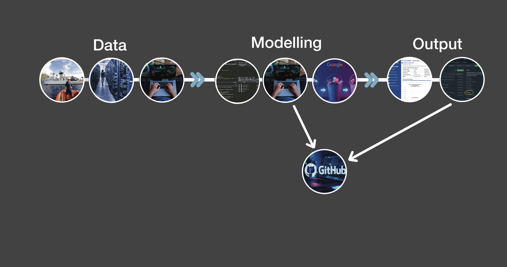
:::

:::

:::{.cr-section layout="overlay-center"}
:::{.text-center}
# Do you think assessments could be automated in your region?
:::
:::
