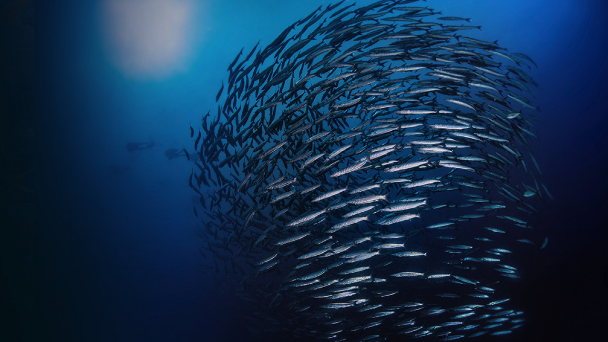
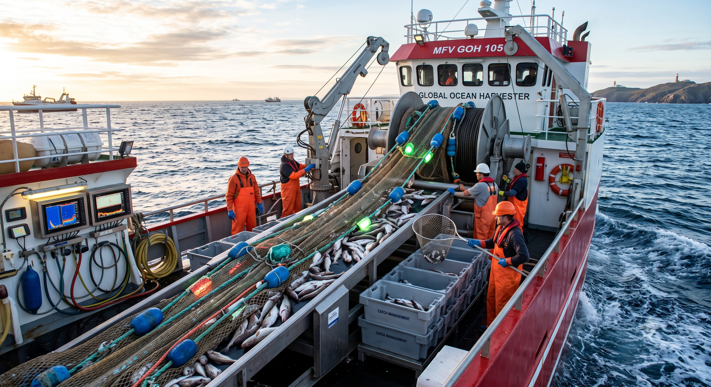

---
format:
  closeread-html:
    cr-style:
      narrative-background-color-overlay: black
      narrative-text-color-overlay: "#e2e2e2"
      narrative-outer-margin: 1:1
      section-background-color: black
      narrative-text-color-sidebar: "#e2e2e2"
---
:::{.cr-section layout="overlay-center"}

:::{focus-on="cr-titleimg"}
# Pipelines
Cloud-based, automated stock assessments.
:::

:::{#cr-titleimg}

:::

:::

::: {.cr-section layout="overlay-center"}

::: {focus-on}
## Why we pursued automation?
Current administration and leadership priorities closely align with the workflows project, FIMS, cloud migration, and data modernization creating opportunities for linkages and foundational components for automation.
:::

:::

::: {.cr-section layout="overlay-center"}

:::{focus-on="cr-efficiency"}
*Efficiency:*
Improved and streamlined processes leads to increased throughput and better reproducibility.
:::

:::{#cr-efficiency}

:::

:::

::: {.cr-section layout="sidebar-right"}

::: {.progress-block}

Cloud Migration @cr-sequence-clouds

*Develop and implement an enterprise modernization plan for fishery-dependent data systems.* @cr-sequence-clouds

Both data and virtual machines provides links to more accessible data via APIs. @cr-sequence-clouds

Goals: @cr-sequence-clouds

* Develop and Deploy Fully Enabled Cloud Solutions @cr-sequence-clouds

* Promote a Data-Driven Culture Through the Adoption of Open Science Initiatives @cr-sequence-clouds

* Formalize the Operating Model for Modernization @cr-sequence-clouds

* Align Data Management and System Standards @cr-sequence-clouds

:::

:::{#cr-sequence-clouds}
```{ojs}
//| echo: false
images = [
  "assets/clouds/frame_00_delay-0.1s.jpg",
  "assets/clouds/frame_01_delay-0.1s.jpg",
  "assets/clouds/frame_02_delay-0.1s.jpg",
  "assets/clouds/frame_03_delay-0.1s.jpg",
  "assets/clouds/frame_04_delay-0.1s.jpg", 
  "assets/clouds/frame_05_delay-0.1s.jpg",
  "assets/clouds/frame_06_delay-0.1s.jpg",
  "assets/clouds/frame_07_delay-0.1s.jpg",
  "assets/clouds/frame_08_delay-0.1s.jpg",
  "assets/clouds/frame_09_delay-0.1s.jpg",
  "assets/clouds/frame_10_delay-0.1s.jpg",
  "assets/clouds/frame_11_delay-0.1s.jpg",
  "assets/clouds/frame_12_delay-0.1s.jpg",
  "assets/clouds/frame_13_delay-0.1s.jpg",
  "assets/clouds/frame_14_delay-0.1s.jpg",
  "assets/clouds/frame_15_delay-0.1s.jpg"
]

// If this section's first trigger is the 3rd trigger in the document, subtract 2
// We use Math.max to make sure we don't end up with a negative index
relativeIndex = crTriggerIndex !== null ? Math.max(0, crTriggerIndex - 2) : 0

// Cap it so it doesn't try to load an image beyond index 15
currentIndex = Math.min(relativeIndex, images.length - 1)

html``

angleScale1 = d3.scaleLinear()
  .domain([0, 1])
  .range([-180, 0])
  .clamp(true)
    
angle1 = angleScale1(crProgressBlock)
```
:::

:::
